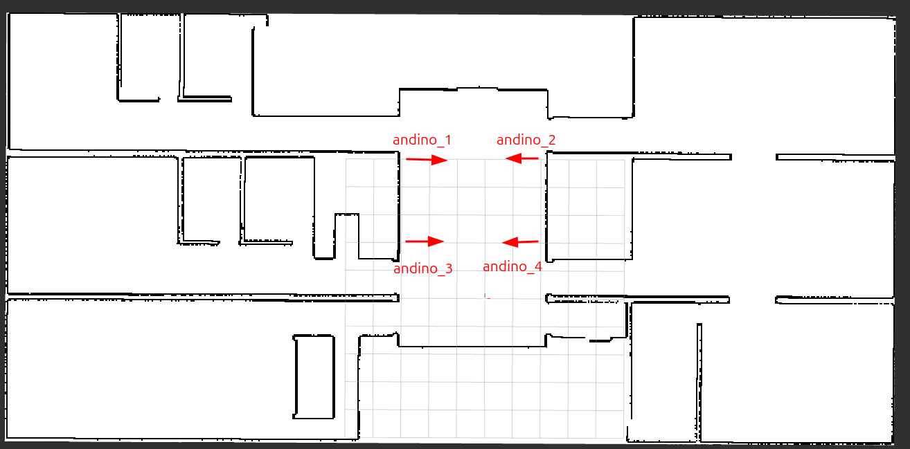

# Andino Simulation for OpenRMF ORO Demo

This directory contains the Docker-based simulation environment for the OpenRMF ORO demo. It runs an Andino robot in Gazebo, connects it to RMF, and streams telemetry to the ORO (InOrbit-compatible) platform.

The simulation is composed of:

- Docker image defined in `Dockerfile`.
- Per-robot Docker Compose file `docker-compose.robot.yml`.
- InOrbit agent and CLI scripts in the `inorbit/` folder.
- Per-robot configuration under `robot_config/<robot_name>/config.env`.
- Helper scripts:
	- `build.sh` to build the simulation image.
	- `initialize_robot.sh` to start a simulated robot.

## 1. First-time setup

### 1.1 Prerequisites

- Linux host with Docker installed.
- A working X11 desktop session (for Gazebo and RViz).

Ensure Docker containers are allowed to use your X11 display, for example:

```bash
xhost +local:docker
```

### 1.2 Build the simulation image

From the root of this repository:

```bash
cd simulation
./build.sh
```

This builds the multi-stage image `andino_inorbit_rmf` used by `docker-compose.robot.yml`. You can override the default image name with `-i` / `--image_name` if needed.

### 1.3 Configure ORO / InOrbit credentials

Edit the `common.env` file in this directory. It is loaded into the robot container by `docker-compose.robot.yml` via `env_file`.

Relevant variables:

- `INORBIT_LIFTOFF_KEY` – Liftoff key from the ORO / InOrbit "connect robot" flow. This is used automatically inside the container to perform a non-interactive agent installation.
- `INORBIT_URL` – Base URL of your ORO / InOrbit control plane (for a local ORO stack this is usually `http://localhost:3000/`).
- `INORBIT_CLI_API_KEY` – API key used by the `inorbit-cli` to apply datasources, actionsources, etc.
- `INORBIT_CLI_URL` – Base API URL for the CLI (e.g. `http://localhost:3000/api`).

You typically set these once for your environment. Per-robot overrides can also be added in each `robot_config/<robot_name>/config.env` if required.

### 1.4 Create per-robot configuration

Each simulated robot has its own folder under `robot_config/<robot_name>/` with a `config.env` file. For example `[simulation/robot_config/andino1/config.env](robot_config/andino1/config.env)`:

```bash
ANDINO_ID="1"
ROS_DOMAIN_ID="10"
INORBIT_ID="620918333"
BATTERY_LEVEL="1.0"
RVIZ="True"
```

Key fields:

- `ANDINO_ID` – Numeric ID passed to the `andino_fleet` launch file goes from 1 to 4.
- `ROS_DOMAIN_ID` – ROS 2 domain for this robot; choose a value that does not clash with other domains in your system.
- `INORBIT_ID` – Robot identifier that will appear in ORO; try to use a uninque numeric value to avoid confusion if you have multiple robots.
- `BATTERY_LEVEL` – Initial battery value reported by the fake battery node (0.0 to 1.0).
- `RVIZ` – Set to `True` to launch RViz inside the robot container, or `False` to disable it.

To add more robots:

1. Create a new folder `robot_config/<robot_name>/`.
2. Copy an existing `config.env` as a template.
3. Adjust `ANDINO_ID`, `ROS_DOMAIN_ID` and `INORBIT_ID` so they are unique per robot.

### 1.5 Create `common.env`

The `common.env` file stores shared ORO / InOrbit configuration that is reused by all robots.

If it does not exist yet, create it in the `simulation/` folder:

```bash
cd simulation
cat > common.env << 'EOF'
INORBIT_LIFTOFF_KEY="<your_liftoff_key>"
INORBIT_URL="http://localhost:3000/"

INORBIT_CLI_API_KEY="<your_cli_api_key>"
INORBIT_CLI_URL="http://localhost:3000/api"
EOF
```

Then edit `common.env` and replace the placeholder values with your own:

- `INORBIT_LIFTOFF_KEY` from the ORO / InOrbit "connect robot" flow.
- `INORBIT_URL` pointing to your ORO instance.
- `INORBIT_CLI_API_KEY` and `INORBIT_CLI_URL` for the InOrbit CLI.

This file is automatically loaded by `docker-compose.robot.yml` when you start robots with `initialize_robot.sh`.

## 2. How Docker is used

The robot container is defined in `[simulation/docker-compose.robot.yml](docker-compose.robot.yml)`:

- Uses `Dockerfile` in this directory to build the image `andino_inorbit_rmf`.
- Runs with `network_mode: host` so the robot can talk directly to RMF and ORO services on the host.
- Mounts the `inorbit/` directory into `$HOME/.inorbit/local/` inside the container; this is where the agent install and configuration scripts live.
- Mounts `/tmp/.X11-unix` so RViz and Gazebo can render on the host display.
- Loads environment from:
	- `robot_config/${ROBOT_NAME}/config.env`
	- `common.env`

You normally do not call `docker compose` directly. Instead, you use `initialize_robot.sh`, which wraps the compose command and sets `ROBOT_NAME` for you eg `./initialize_robot.sh andino1`.

## 3. InOrbit / ORO integration and the entrypoint

The container entrypoint is `[simulation/entrypoint.sh](entrypoint.sh)`. On startup it:

1. Sources the ROS and RMF environments.
2. Runs `$HOME/.inorbit/local/install.sh` (best-effort):
	 - This script uses `INORBIT_LIFTOFF_KEY` to download and run the InOrbit "liftoff" installer.
	 - The installation is done **inside the container**; you do *not* need to run the `curl https://control.inorbit.ai/liftoff/... | sh` command manually.
3. Builds the Andino workspace with `colcon build` and sources `install/setup.bash`.
4. Runs `$HOME/.inorbit/local/run.sh`:
	 - Reads the variables exported by `agent.sh`.
	 - Updates `agent.env.sh` with the evaluated values.
	 - Starts the InOrbit agent process in the background.
5. Runs `$HOME/.inorbit/local/cli/apply_config_cli.sh` to apply the CLI configuration (datasources, dashboards, etc.) against `INORBIT_CLI_URL`.
6. Launches the simulation:

```bash
ros2 launch andino_fleet andino.sim.launch.xml \
	id:=${ANDINO_ID:-1} \
	rviz:=${RVIZ:-false} \
	battery_level:=${BATTERY_LEVEL:-1.0}
```

This launch file brings up Gazebo, Nav2 and (optionally) RViz for the simulated robot.

> Summary: both the **InOrbit agent installation** and the **agent runtime service** are started automatically from the container entrypoint. You only need to configure the environment files and start the robot container.

## 4. Initializing and running a robot

Use `initialize_robot.sh` to start a simulated robot instance:

```bash
cd simulation
./initialize_robot.sh andino1
```

This script:

- Verifies that `robot_config/andino1/config.env` exists.
- Sets `ROBOT_NAME=andino1`.
- Runs `docker compose -f docker-compose.robot.yml -p andino1_fleet up -d`.

Once the container is up:

- The InOrbit agent is installed (if not already) and started automatically from the entrypoint.
- The Andino simulation stack, Gazebo and RViz are launched according to your `config.env`.
- The robot appears in ORO with the configured `INORBIT_ID` and starts streaming telemetry (battery, map, etc.).

To launch an additional robot (for example `andino2`):

1. Create `robot_config/andino2/config.env` based on `andino1`.
2. Adjust `ANDINO_ID`, `ROS_DOMAIN_ID` and `INORBIT_ID` to unique values.
3. Run:

```bash
./initialize_robot.sh andino2
```

Each robot runs in its own Docker Compose project (`<robot_name>_fleet`), so starting one robot does not stop the others.

## 5. Gazebo, RViz and localization

When a robot container starts (via `initialize_robot.sh`):

- Gazebo launches with the Andino world.
- RViz is launched inside the container if `RVIZ="True"` in the robot's `config.env`.

To start the simulation and localize each robot:

1. In Gazebo, press the **Play** button to start the physics simulation.
2. In RViz, select the appropriate Nav2 pose / **2D Pose Estimate** tool.
3. For each robot, publish an initial pose on the Nav2 pose topic so the localization filter is correctly initialized.

The initial pose can be set approximately by clicking on the map in RViz, or you can publish a specific pose with `ros2 topic pub` if you prefer, use this image as a reference for the initial pose coordinates:


---

With these pieces configured, you can use the ORO user interface to send tasks to the simulated robots and observe their state, paths and battery levels in real time.